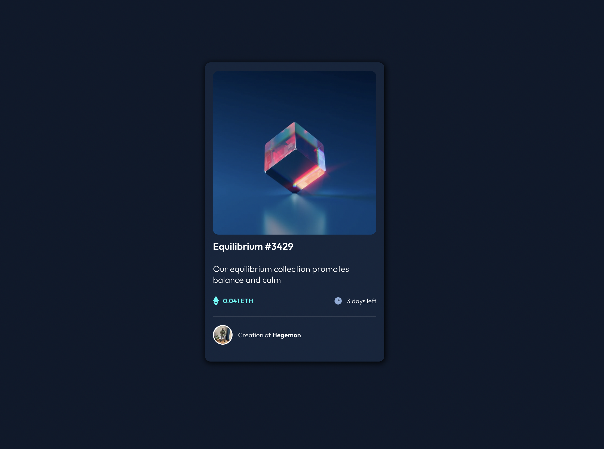

# Frontend Mentor - NFT preview card solution

This is a solution to the [NFT preview card component challenge on Frontend Mentor](https://www.frontendmentor.io/challenges/nft-preview-card-component-SbdUL_w0U). Frontend Mentor challenges help you improve your coding skills by building realistic projects.

## Table of contents

- [Overview](#overview)
  - [The challenge](#the-challenge)
  - [Screenshot](#screenshot)
  - [Links](#links)
- [My process](#my-process)
  - [Built with](#built-with)
  - [Useful resources](#useful-resources)
- [Author](#author)
- [Acknowledgments](#acknowledgments)

## Overview

### The challenge

Users should be able to:

- View the optimal layout depending on their device's screen size
- See hover states for interactive elements

### Screenshot



### Links

- [NFT preview card](https://nft-preview-card-smoky.vercel.app/)

### Built with

- Semantic HTML5 markup
- CSS custom properties
- Flexbox
- Mobile-first workflow
- [React](https://reactjs.org/) - JS library (This project was bootstrapped with [Create React App](https://github.com/facebook/create-react-app))

### What I learned

I gained basic understading of implementing/positioning elements, using absolute/relative, as well as centering said element. @smug took time to explain to me.

```css
.header--wrap {
	position: relative;
	cursor: pointer;
}

.img--overlay {
	background-color: var(--clr-accent);
	border-radius: 10px;
	position: absolute;
	top: 0;
	bottom: 0;
	left: 0;
	right: 0;
	opacity: 0;
	transition: opacity 0.5s ease;
}

.img--overlay img {
	position: absolute;
	top: 50%;
	left: 50%;
	transform: translate(-50%, -50%);
}

.header--wrap:hover .img--overlay {
	opacity: 0.5;
}

.header--img {
	border-radius: 10px;
	vertical-align: bottom;
}
```

### Useful resources

- [Scrimba](https://scrimba.com/learn/learnreact) - This platform provided me with an opportunity to learn react for free
- [React](https://reactjs.org/) - This is an amazing web page provides you all the resources you need to put together to get your react app working perfectly on your local machine

## Author

- Github - [@soji](https://github.com/soji-opa)

## Acknowledgments

I am very grateful to[Smug](http://portfolio-fawn-zeta.vercel.app/) & [Openwell](https://github.com/openwell) for always making time out of their busy schedules to see to my coding challenges and providing me with extra motivation.
